# 내부 법규 교육(유럽일반/표준안)

## 교육 항목의 핵심
1. 유럽 법규는 차량 기능뿐 아니라, 사용자의 이해와 사용 방식까지 규제한다

## 전달하고 싶은 내
1. 왜 유럽 법규는 특정 문구와 경고를 요구할까?
2. 왜 오너스 매뉴얼까지 법규의 대상이 되는가?
3. 단순한 문장이 실제 안전 리스크가 되는 경우
4. 실무자의 입장에서 생각해보기

# 시작 전에 이야기 하기

## :open_book: 왜 요즘 유럽 법규는 매뉴얼까지 관리할까?

- 차량 기능이 정상이어도, 필요한 법규 정보가 매뉴얼에 없으면 제조사 책임 이슈와 소비자 안전 책임 부족으로 이어질 수 있음
- 고객이 해당 내용을 인지하지 못해, 기능 고장 및 사고 시 대응을 못했다고 주장할 수 있는 **크리티컬한 요소**가 될 수 있음
- 사용자의 잘못된 이해와 오사용이 실제 사고로 이어질 수 있기 때문에, 오너스 매뉴얼도 법규 대상이 됨

## :open_book: 유럽 법규의 핵심 포인트
- 과거 유럽 법규: 차량 기능만을 규제
- 현재 유럽 법규: 사용자 이해/오사용/정보 접근성까지 규제
- 사용자의 유지관리 가능성까지 포함하여 판단
> :dart: 결론: 이제는 오너스 매뉴얼도 차량 기능의 일부로 간주함  
> - [X] 안전 커뮤니케이션 관점으로도 접근 필요!
> - [X] 테크니컬 라이터의 관점에서도, 법규 내용을 참고하여 초안 내용을 이해하며 작성하는 것이 필요!

# PAB 후향 CRS 금지

## 오너스 매뉴얼 적용  :writing_hand:*법규 조항 ECE R-94*
- Seating and safety restraints 챕터 중, **Air bag warning labels**내 문구 적용
  
## :open_book: 왜 유럽은 "후향 카시트"를 이렇게 강하게 금지할까?
- [X] 치명적 위험성
  - 조수석 에어백 전개 시, 팽창 충격이 카시트 후면에 직격하여 영유아에게 치명적 타격 유발(어른만 안전함)
- [X] 강력한 경고 의무
  - 단순 안내를 넘어 DEATH or SERIOUS INJURY와 같은 최고 수준의 위험 문구 명시 요구
- [X] 시인성 확보
  - 사용자가 위급 상황을 즉각 인지할 수 있도록 법규에서 정한 라벨 형상 및 경고문을 매뉴얼에 반드시 포함

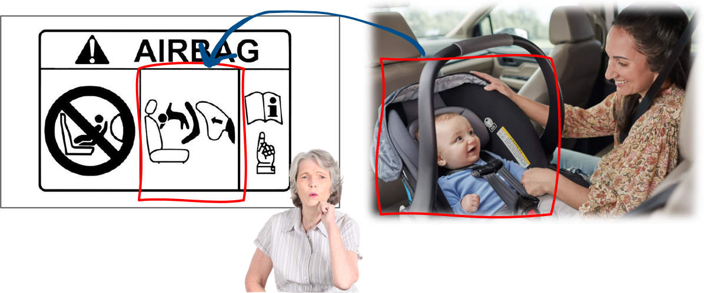

## :dart: 실무자 이해 포인트
- [X] 유럽(EU)는 기능보다 사용자의 오사용 방지에 대해 더 강한 중점을 두고 있음
- [X] 에어백 라벨 내용이 향지에 맞게 적용되었는지 확인
- [X] 아래 경고 문구가 적용되었는지 확인

  > **NEVER use a rearward facing child restraint on a seat protected by an ACTIVE AIRBAG in front of it.**  
  > **DEATH or SERIOUS INJURY to the CHILD can occur.**  
  > *앞좌석에 에어백이 작동하는 경우, 절대로 후방 장착형 유아용 카시트를 사용하지 마십시오.*  
  > *어린이가 사망하거나 심각한 부상을 입을 수 있습니다.*

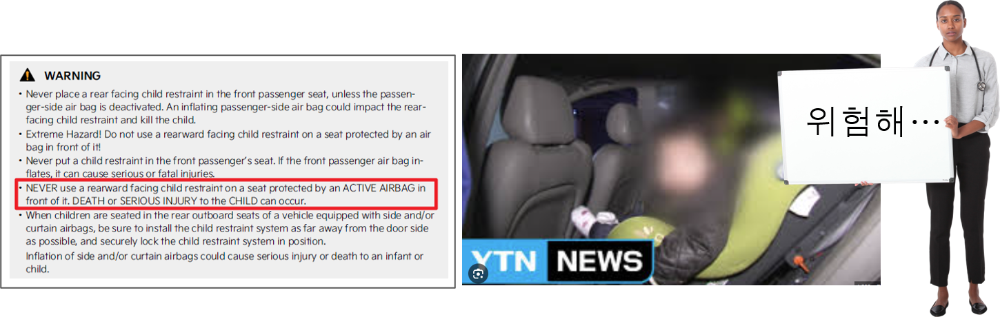

# SBR (Seat Belt Reminder)

## 오너스 매뉴얼 적용  :writing_hand:*법규 조항 ECE R-16.07*
- Seating and safety restraints 챕터 중, **Seat belt restraint system**내 문구 적용

## :open_book: 왜 유럽은 안전벨트 경고 시간을 계속 늘릴까?
 	:pushpin: 최근 Qve EV 차종의 경우 35초에서 100초로 SBR 시간 추가
- [X] 법규 규제
  - 안전벨트 미착용 자체를 엄격히 관리해야 할 위험 행동
- [X] SBR의 역할
  - 단순 경고를 넘어 운전자의 행동 교정을 유도하며, 탑승자 생존율 및 EuroNCAP 평가와 직결됨
- [X] 설계 핵심
  - **사용자가 경고를 충분히 그리고 즉각적으로 인지할수 있는지가 가장 중요한 판단 기준**

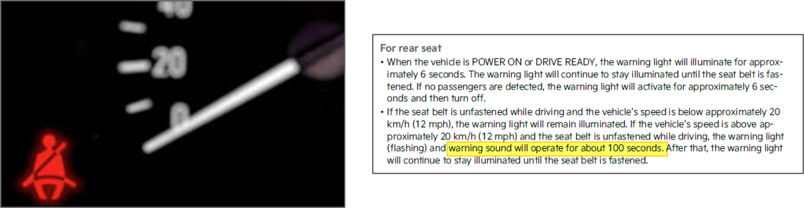

## :dart: 실무자 이해 포인트
- [X] SBR 적용 범위 사양 검토
    - 차종별 시트 사양과 연계하여 전 좌석 (앞/뒤/중앙) 적용 상태 확인
    - 가운데 좌석 로직 유무 등 상세 사양 검증
- [X] 유럽 법규 준수 여부
    - 최근 개정된 유럽 법규에 따른 경고 시간 변화 등 상시 업데이트 체크 및 반영
- [X] 쥬요 확인 요소
    - 경고 작동 조건 / 경고등 지속시간 / 경고등 형상 및 표시 유무

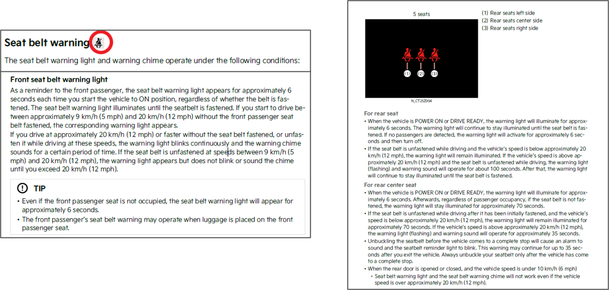

# 폴딩 시트 사용 주의 문구

## 오너스 매뉴얼 적용  :writing_hand:*법규 Folding 시트, 쿠션, 시트백 적용 시 S/belt 77/541/EEC ECE R-16*
- Seating and safety restraints 챕터 중, **Care of seat belts**내 문구 적용

## :open_book: 왜 폴딩 시트에도 법규가 적용되는걸까?
- [X] 규제 범위 확대
  - 가변형 시트(폴딩 등) 작동시 발생할 수 있는 안전벨트 손상 가능성까지 법규 규제 범위에 포함됨
- [X] 위해성 고지 의무
  - 시트 조작 과정에서 안전벨트가 손상될 수 있다는 점과 그에 따른 부상 위험을 사용자에게 명확히 고지
- [X] 유지관리의 중요성
  - **안전벨트는 필수로 장착해야 하지만, 그와 더불어 사용 과정에서의 유지보수가 필수 조건임을 명시**

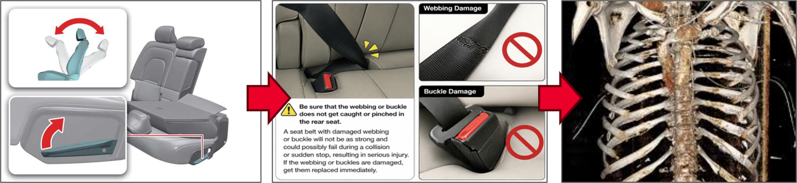

## :dart: 실무자 이해 포인트
- [X] 앞좌석/뒷자석의 접기(folding) 가능한지 사양 체크
- [X] 단순 시트에 대한 내용이 아니라, 반복 사용에 의한 부속품의 유지보수 및 고장 여부까지 참고 필요
- [X] 평상시가 아닌 사고시 부상 또는 사망 위험을 최소화할 수 있도록 성능을 유지하는 것이 포인트
- [X] 사용 중 손상은 사용자가 인지 못할 가능성이 크기 때문에, 오너스 매뉴얼에 해당 내용을 계속 추가하고 있음
  - 사용자가 제품을 사용 후 확인까지 할 수 있도록 유도(점검 필요)

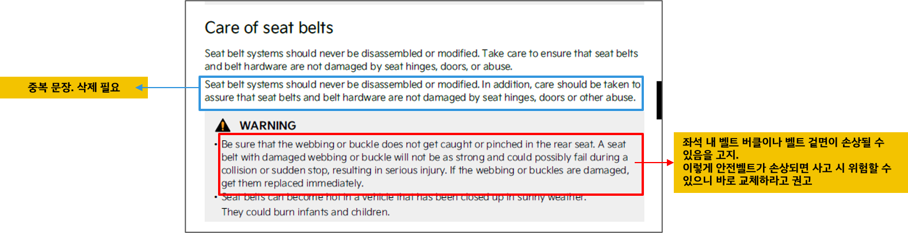

# CRS 테이블 정보 제공

## 오너스 매뉴얼 적용  :writing_hand:*법규 조항 77/541/EEC ECE R-16*
- Seating and safety restraints 챕터 중, **Child Restraint System**내 문구 적용

## :open_book: 왜 유럽 법규는 유아용 카시트에 대한 정보까지 요구할까?
- [X] 안전 검증의 본질
  - 유아용 카시트는 단순히 장착 여부만이 아니라, 검증된 안전성과 적합성이 더 중요
- [X] 사용자 인식과의 괴리
  - 일반 사용자는 차량 내 공간적 여유만 있으면 장착이 가능하다고 판단하기 쉬우나, 하지만 실제로는 CRS 테이블에 기재된 조건에 따라 보호 성능 자체가 달라짐

## :dart: 실무자 이해 포인트
- [X] CRS 안전성은 좌석 위치 + 설치 방향 + 차량 상태 (Airbag ON/OFF, 후향 CRS 금지 등) 조합으로 결정될 수 있음
- [X] ISOFIX, Non-ISOFIX의 차이점
  - 유럽 EVE 인증은 카시트가 아이를 얼마나 잘 보호하는 지를 엄격히 테스트하고 법규로 관리함
  - 이 때 두 가지 인증 방식으로 관리

| 항목/분류 | ISOFIX | Non-ISOFIX |
|---|---|---|
| 인증방식 | ISOFIX 커넥터를 이용해 차체에 고정했을 때의 안정성 | 차량용 3점식 안전벨트로 카시트를 고정했을 때의 안정성|
| 차량 호환성 | 2010년 이후 출시 차량은 의무 적용 | 일부 특수 차량이나 2010년 이전 차량은 anchor가 없을 수 있음|
| 사용자 접근성 | 딸깍 소리가 나게 끼우면 설치 완료(쉬움) | 설치 과정이 복잡하지만, 설명서를 보고 시도 가능|
| i-Size 규정 적용 | ISOFIX 장착을 필수 조건으로 지정 | ISOFIX 방식이 아니지만 여전히 EVE 유럽법규에서는 안전벨트 고정 방식을 허용|

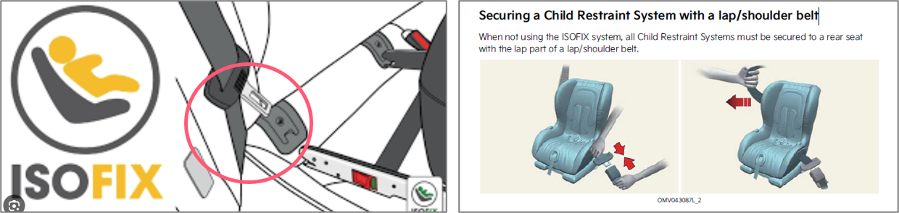

- [X] 복잡한 테이블이지만 오너스 매뉴얼에 구성하여, 사용자가 추측하여 설치하거나 혼란스럽지 않도록 정보 제공이 필요
- [X] 사고 발생 시 제조사가 어떤 안전 정보를 제공했는지 여부까지 이어질 수 있음 (책임 소재)
- [X] 연구소에서 받은 인증 자료와 반드시 일치해야 하며, 추천 CRS 브랜드 정보, i-Size 심볼 포함 여부까지 고려하여 초안 작성

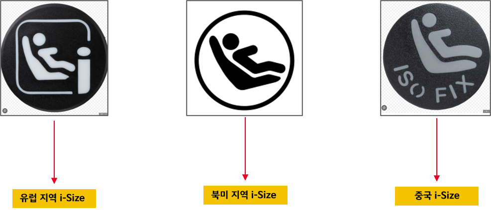

# EDR (사고 기록 장치)

## 오너스 매뉴얼 적용  :writing_hand:*법규 조항 ECE R-116*
- Introduction 챕터 중, **Vehicle data collection and Event Data Recorders**내 문구 적용
  
## :open_book: 사고 직전 차량은 무엇을 기록하고 있을까?
- [X] 사고 전후 데이터 보존
  - 사고 발생 전후 일정 시간 동안의 차량 주행 데이터를 실시간으로 기록 및 저장
- [X] 기록 장치 장착의 의무화
  - 사고 원인 분석 및 차량 안전성 개선을 위한 기록 장치(EDR 등) 탑재가 법적 필수 사항으로 강화
- [X] 법적 증거 능력 확보
  - 운전자의 조작 정보 및 차량 상태가 정밀하게 기록되어, 법적 분쟁 시 핵심 증거 자료로 활용 가능

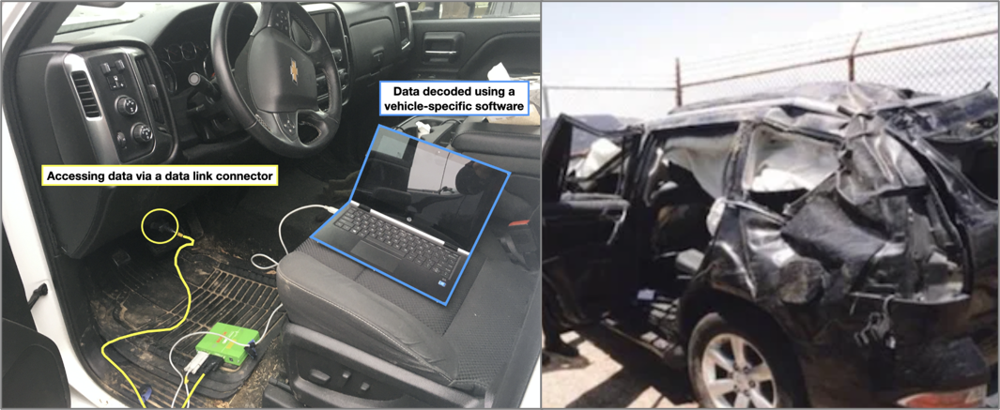

## :dart: 실무자 이해 포인트
- [X] 감시 장치보다는 사고 분석 및 안전 개선 시스템으로 가치 판단
- [X] 데이터 수집 가능성 및 개인 정보/데이터 처리에 대한 사용자 고지 필요
- [X] 국가/지역별로 다른 EDR 사양과 세부 항목을 반드시 확인 (유럽/북미/일반/중국 등)
- [X] 법규 표준 영문 표기법 (철자, 문장부호, 대소문자 등)과 100% 일치 필요

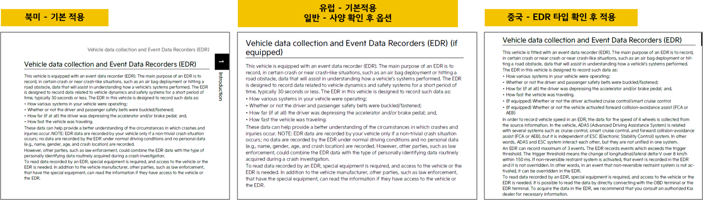

# 브레이크 마찰제 (점검 주기 관련)

## 오너스 매뉴얼 적용  :writing_hand:*법규 조항 458/2011/EU R-13.09, R-13H*
- Driving your vehicle 챕터 중, **Disc brakes wear indicator**내 문구 적용
- Maintenance 챕터 중, **Scheduled maintenance service**내 문구 적용
  
## :open_book: 디스크 브레이크는 차량 안에 설치된 부품인데 왜 법규에 해당할까?
- [X] 안전 확보를 위한 최종 경고
  - 디스크 브레이크 마모 인디케이터는 제동 성능 한계 도달 전, 차량이 보내는 마지막 SOS 신호
- [X] 사고 예방의 필수성
  - 브레이크 패드 마모 시, 제동 거리가 급격히 증가하여 대형 사고로 직결 위험이 큼
- [X] 법적 고지 의무 및 책임 강화
  - 경고등 점등 조건과 주의사항을 매뉴얼에 명시하도록 법규로 강제함으로써 운전자가 인지하고 적기에 차량을 점검할 수 있도록 유도 (관리 책임 이행)

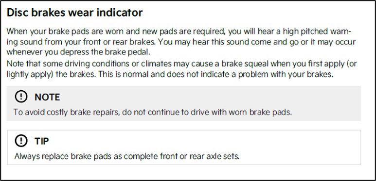

## :dart: 실무자 이해 포인트
- [X] 제조사의 책임 영역 확대
  - 유럽(EU) 법규는 부품의 품질뿐만 아니라, 차량의 지속적인 유지보수 정보 제공에 대한 제조사의 책임을 매우 엄격하게 규정
- [X] 정보 고지 미흡에 따른 리스크
  - 사용자의 인지 부족으로 발생한 사고일지라도, 적절한 안내가 없었다면 제조사의 책임으로 판단될 가능성이 높음
- [X] 인식의 전환  
  :x: 단순 하드웨어 신뢰: *부품이 견고하게 제작되었으므로 문제 없을 것* 이라는 안일한 판단 지양  
  :o: 사용자 가이드 중심: 점검 조건, 시기, 경고등의 의미를 고객에게 정확히 전달하여 안전한 사용 환경을 조성해야 함
  - 매뉴얼 내 점검/경고 관련 세부 항목 누락 여부 확인
  - 점검주기 표 내 **Brake discs and pads**란 항목과 알맞은 주기로 적용되었는지 확인

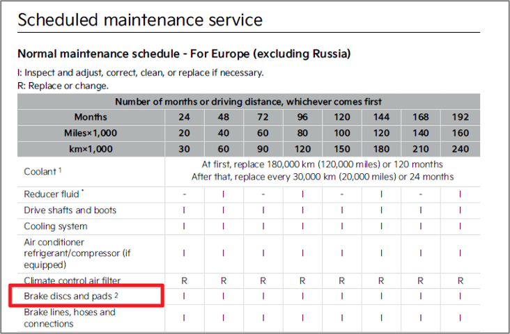

# 배출가스 저감 장치 (점검 주기 관련)

## 오너스 매뉴얼 적용  :writing_hand:*법규 조항 2000/4/EC ECE R-21*
- Maintenance 챕터 중, **Scheduled maintenance service**내 문구 적용
  
## :open_book: 배출가스 저감 장치의 관리 책임이 운전자까지 부여되는 이유는?
- [X] 환경 영향과 직결
  - 흡배기 시스템 및 저감 장치(GPF,DPF 등)의 성능 유지 실패는 유해 배출가스량의 급격한 증가로 이어짐
- [X] 사용자 가변성 인정
  - 운전자의 주행 습관 및 정기 점검 이행 여부가 실질적인 배출가스 제어 성능에 결정적인 영향을 미침을 법규에 명시
- [X] 규제 범위의 확대
  - 법적 의무가 장치의 단순 장착 단계에서, 운행 전 주기에 걸친 성능 유지 및 관리로 강화되는 추세

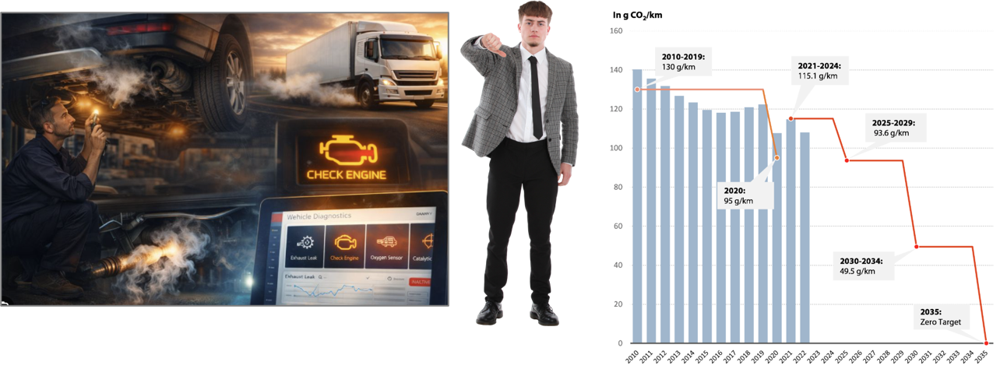

## :dart: 실무자 이해 포인트
- [X] 파워트레인별 적합성 검토
  - 차종 내연기관 유형 (EV/ICE)에 따라 유지보수 주기가 법적 기준에 맞게 적용되었는지 확인
  - 흡배기 장치는 배출가스 저감 시스템의 필수 구성 요소로서, **지속 가능한 환ㄱ녕 성능 유지** 관점에서 관리 필요함
  - 흡배기 장치 뿐만 아니라, 이와 직결된 DPF (디젤 미세먼지 필터) 및 GPF (가솔린 미세먼지 필터) 등 후처리 장치의 손상 가능성까지 고려
  - 사용자의 점검 소홀로 인한 미정화 배출가스 방출 및 배출 허용 기준 초과는 심각한 환경 오염과 법적 위반을 초래할 수 있음을 인지

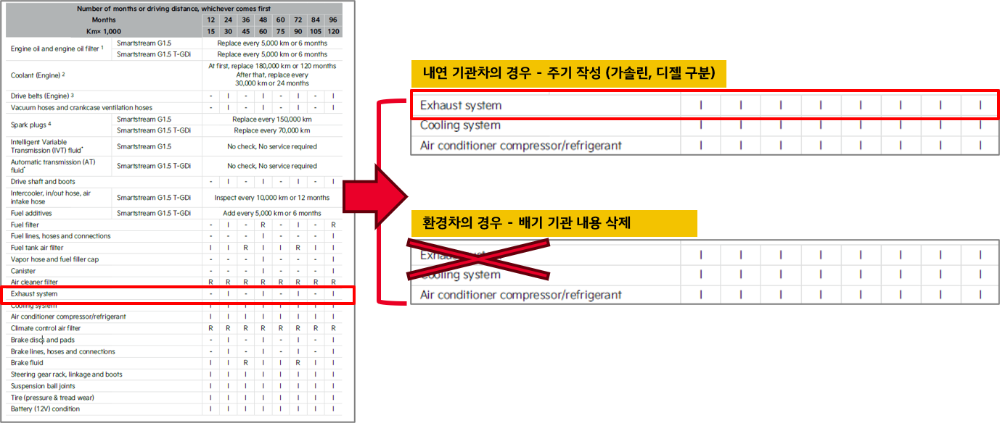

# eCall System

## 오너스 매뉴얼 적용  :writing_hand:*법규 조항 2017/758 The Eurasian Economic Union (EAEU) and the UN-R 144 for approval within the UN*
- What to do in an emergency 챕터 중, 향지별 **eCall system** 내용으로 구성
  
## :open_book: 왜 국가마다 서로 다른 eCall 시스템을 운영할까?   :open_book: 왜 유럽 법규는 eCall 배터리 점검주기까지 관리할까?

- [X] 인명 구조의 골든타임 확보
  - 국가별 시스템의 차이에도 불구하고, 사고 발생 직후 초동 조치를 위한 골든타임 확보를 최우선 가치로 설명함
- [X] 사고 대응의 자동화
  - 운전자가 의식을 잃는 등 스스로 신고가 불가능한 긴급 상황 발생 시, 차량이 자동으로 위치 정보를 송신하여 즉각적인 구조 체계 가동
- [X] 지리적 한계 극복
  - 광활한 영토 특성상 구조 지연 위험이 높은 지역에서의 대응력 강화
- [X] 위의 조치를 진행하기 위해서는 차량 전원 손실 시에도 작동이 필요하기 때문에 **배터리 점검이 중요**

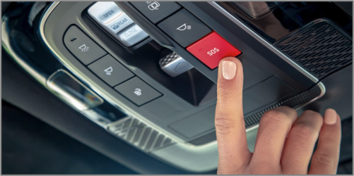

## :dart: 실무자 이해 포인트

## EU - Pan European eCall System (if equipped) 
- [X] 시스템 목적
  - 사고 직후 운전자의 대응 불능 상태(의식 상실, 패닉 등)를 대비한 긴급 구조 지원
- [X] 오너스 매뉴얼 필수 고지사항(구조 효율성 직결)
  - 작동법: SOS 버튼 위치 및 조작 방법
  - 데이터 투명성: 외부 전송 정보의 종류(위치, 차량 정보 등)
  - 프로세싀 조작 후 구조 센터 연결까지의 단계와 소요 시간
- [X] 사고 대응을 위한 유럽 전역의 안정적인 긴급 구조를 보장하는 표준 안전 시스템임을 명확히 전달

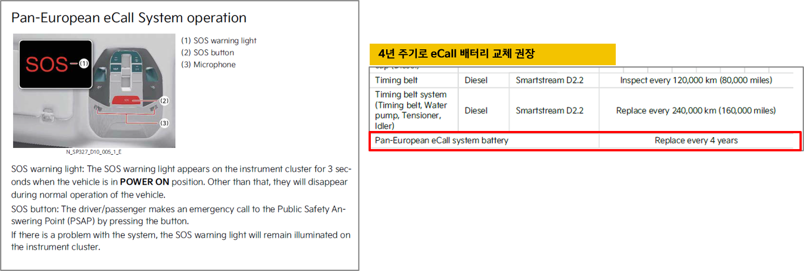

## UAE - Emergency Call (eCall) System (if equipped) 
- [X] 시스템 목적
  - 사막 및 외곽 지역이 많은 UAE 특유의 지리적 환경을 고려하여, 사고 후 구조 지연 및 고립 상황을 극복하는 데 중점을 둠
- [X] 오너스 매뉴얼 필수 고지사항(고립 시 생존 가능성 확보와 직결)
  - 작동법: SOS 버튼 위치 및 직관적인 조작 방법 안내
  - 데이터 투명성: 사고 시 외부로 전송되는 정보 항목(위치, 차량 정보 등) 명시
  - 프로세스: 버튼 조작 시점부터 구조 센터 연결까지의 단계별 흐름 정보 제공
- [X] 단순 통신 기능을 넘어, 극한 환경에서의 생존 가능성 확보를 위한 필수 안전 시스템임을 명확히 전달할것

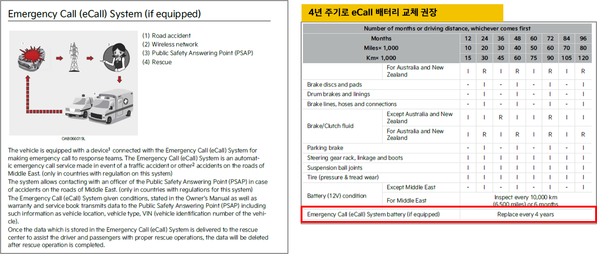

## Russia - ERA-GLONASS System (if equipped) 
- [X] 시스템 목적
  - 광활한 영토와 지역별 통신 편자, 혹한의 기후 등 러시아 특유의 환경적 요인에 따른 구조 지연 및 고립 상황을 극복하는데 중점을 둠
- [X] 오너스 매뉴얼 필수 고지사항(독자적 위성망 기반의 국가 구조 체계 연동)
  - 작동법: ERA-GLONASS 버튼 위치 및 수동/자동 긴급 호출 방법 안내
  - 데이터 투명성: 러시아 자체 위성(GLONASS)을 통해 전송되는 정보 항목(위치, 차량 정보 등) 명시
  - 프로세스: 버튼 조작 시점부터 러시아 현지 구조 센터 연동 및 국가 승인까지의 흐름 정보
- [X] 미국 GPS 의존도를 탈피한 독자적 위성 인프라를 통해, 국가적 통제력을 확보하고 극한 환경에서의 생명 보호를 실현하는 핵심 안전시스템

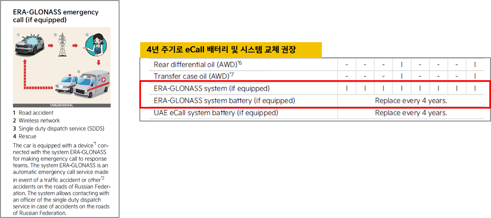

# EURO7

## 오너스 매뉴얼 적용  :writing_hand:*법규 조항 Euro 6d / Euro 6e / Euro 7에 대한 개정 조항 (EU) 2023/443*
- 메뉴얼 전반(여러 챕터)에 걸쳐 관련 법규 적용
  
## :open_book: 왜 EURO7은 엔진 규제를 넘어서고 있을까?
- [X] 규제 범위 확대
  - 기존의 배출가스 기준을 넘어 실제 주행 및 사용 환경 전반으로 규제 영역 확장
- [X] 사용자 유지 관리 의무 강화
  - 배출가스 저감 성능 유지를 위한 장기 관리 방안을 사용자에게 고지하고 준수 유도
- [X] 비배기 오염 물질 규제 도입
  - 전기차도 친환경적에 속하지만, 무거운 배터리 때문에 브레이크/타이어 소모(미세먼지)를 규제 대상에 포함
- [X] 전 생애 주기 책임 실현
  - **차량 구매** 부터 폐기까지 환경 영향을 최소화하는 차량 생애 주기 책임제의 개념 도입

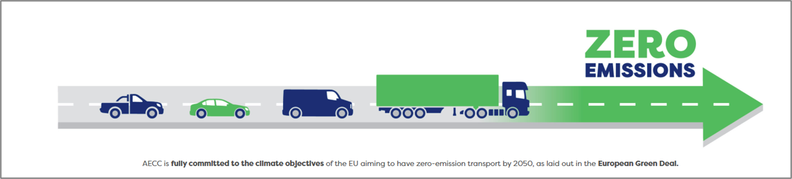

## :dart: 실무자 이해 포인트
- [X] 실제 도로 주행 환경에서의 환경 부하 최소화 및 실효성 확보
- [X] 엔진 상테와 배출 성능 유지를 위한 관리 시스템에 대한 정보 고지 필요
- [X] 단순 엔진만이 아닌, 브레이크 분진이나 타이어 마모, 냉매, 환경차까지 환경 규제 범위는 확대되고 있음
- [X] EURO7 사양 해당 시, 엔진명 구분과 EURO7에 필요한 점검주기 챕터의 포인트들 숙지할 것

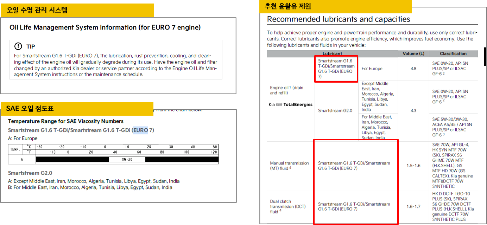

- [X] EURO7 법규가 적용되는 차종인 경우, 다른 파트에도 연관된 내용이 표시됨
- [X] 엔진명 표기, GPF(Gasoline Particulate Filter) for EURO7 engine 등 연관되는 다른 파트의 내용에 대한 인식이 필요함

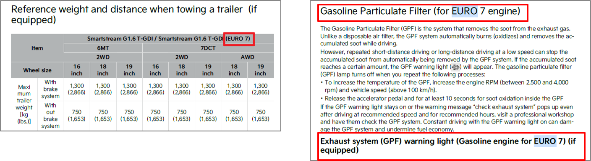

# 유럽 CE/UKCA 인증

## 오너스 매뉴얼 적용  :writing_hand:*법규 조항 UKCA 인증, 1995/5/EC 2014/53/EU*
- What to do in an emergency 챕터 중, **Declaration of Conformity for Jack**로 적용
  
## :open_book: 왜 오너스 매뉴얼에 무선 인증 문구까지 넣어야 할까?

- [X] 과거 자동차는 기계 장치로 분류됨(구동)
- [X] 현재 자동차는 **Rolling Electronic Device**로 진화함(복합적)
- [X] 기능이 완벽하게 작동하고 소프트웨어도 정상이지만, **인증문구(DoC)나 라벨이 포함되지 않으면 법규 불충족**
- [X] ADAS, Digital Key, eCall, ROA, Smart Key, Bluetooth, Wi-Fi  
     📍전부 무선 장치

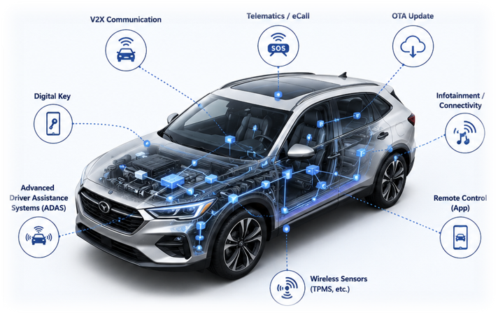

## :dart: 실무자 이해 포인트
- [X] 제품에 대한 인증 뿐만 아니라 오너스 매뉴얼에 해당 인증 정보 누락 시, 인증이 완료되지 않았음으로 판단할 수 있음  
     📍인증 부족으로 판단 시, 자동차 수출 통관 차단 및 리콜 사태나 고객 고소까지 이어질 수 있음
- [X] 무선 통신/소프트웨어/보안/OTA 등 무선 기기를 이용한 인증 및 기능 내용들까지도 법규 대상에 포함됨
- [X] 판매 국가가 유럽 국가들에 포함되는가? (**CE 인증 내용 무조건 포함!**)
- [X] 판매 국가에 영국(UK)이 포함되어 있는가? (**UKCA 인증 내용 무조건 포함!**)

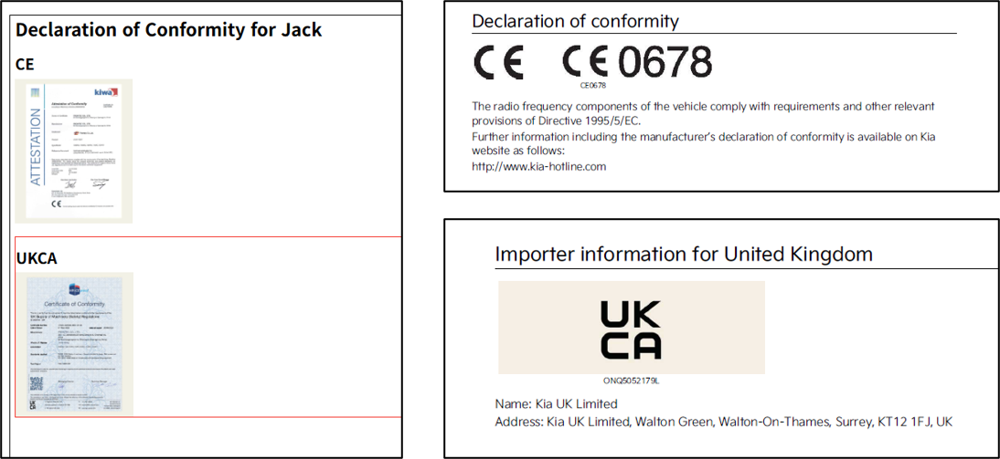

## :dart: 참고
- [X] CE 인증이란?
  - 유럽 시장에서 판매 가능한 제품이라는 의미의 인증 적합성 표시
  - 하지만 더 큰 의미로는, 이 인증 마크가 표시된 제품은 안전/전자파/무선 등 관련 EU 법규를 만족한다는 뜻
- [X] UKCA 인증이란?
  - 영국 시장에서 판매 가능한 제품이라는 인증 적합성 표시
  - 원래 영국은 EU 소속이었기 때문에 CE 인증마크만 사용했으나, 브렉시트(Brexit) 이후 EU에서 탈퇴하면서 영국용 별도 인증 마크로 분리됨

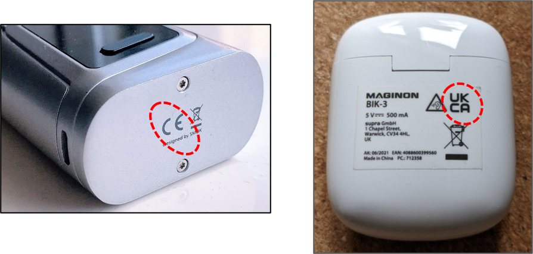

# 외장램프 교환 방법

## 오너스 매뉴얼 적용  :writing_hand:*법규 조항 76/756/EEC ECE R-48*
- Maintenance 챕터 중, **Light bulbs** 내용으로 구성
  
## :open_book: LED로 거의 바뀌고 있는 시대임에도 왜 아직 법규는 Bulb replacement를 요구할까?
- [X] 과거 할로겐 램프나 백열등 같은 전구(bulb)는 사람이 직접 교체 가능했음
- [X] 현재는 LED/Integrated LED module로 변경되고 있고, LED 램프의 특성상 소비자가 직접 교체하기 어려움
- [X] 따라서 이 법규는 아직도 아래와 같은 내용을 요구함
  - 접근 가능성
  - 사용자 교체 가능 여부에 따른 제조사 서비스센터 방문 권유
  - 개인적인 장비 사용 제한

## :dart: 실무자 이해 포인트
- [X] 차종별로 램프 구성 확인
- [X] BULB와 LED 사양을 제품사양서 또는 연구소에 확인 후 초안 작성
- [X] LED 램프의 경우, 교체 방법 대신 **professional workshop**과 **authorized Kia dealer or service partner**에게 방문하라는 유도 문구가 있는지
- [X] BULB 램프의 겨우, 각 램프별 종류에 맞게 교체하는 방법 서술 필요

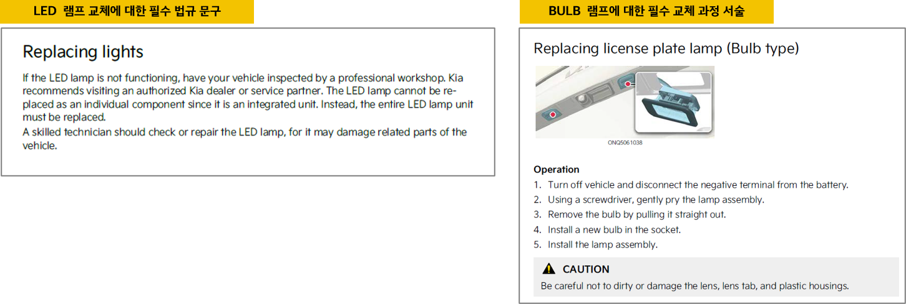

# 디지털 키

## 오너스 매뉴얼 적용  :writing_hand:*법규 조항 ECE R-116*
- Seating and safety restraints 챕터 중, **Digital Key 2(사양 적용 시)** 로 적용
  
## :open_book: 왜 요즘 차량은 스마트폰 하나만 잃어버려도 보안 이슈가 될까?
- [X] 도난 방지 보안성
  - 디지털 키 복제나 무선 해킹을 방지하기 위해 물리적 키 이상의 고도화된 암호화 기술 적용 필수
- [X] 시동 권한
  - 주인임을 증명하지 않으면 디지털 키라도, 차의 엔진에 시동이 걸리지 않도록 설계 필요
- [X] 안전성
  - 스마트폰 배터리가 없거나 통신 오류가 발생해도, 차문이 저절로 열리는 일이 없도록 잠금 상태를 유지하도록 함  
  📍현대 시대의 자동차는 고도의 전자 보안 시스템으로 진화중

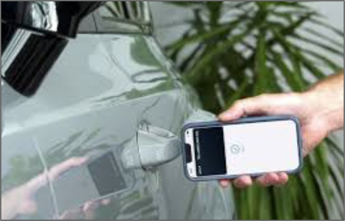

## :dart: 실무자 이해 포인트
- [X] 단순 편의 기능이 아니라 전자 보안 접근 시스템으로 인식
- [X] 사용자 인증 실패도 차량 관리의 리스크로 보기 때문에 매뉴얼에 작동 방법도 같이 기재 필요
- [X] 따라서 디지털 키의 등록/해제 방법은 사용자 정보 제공과 더불어, 차량 보안을 유지하는 가장 핵심 요소

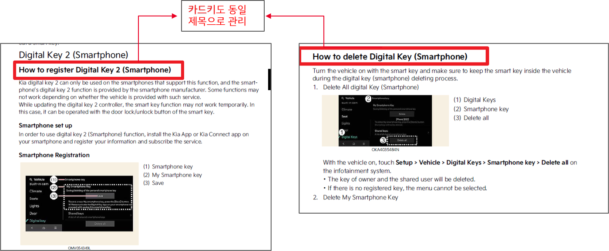

# 파워윈도우/선루프/파티션에 대한 주의

## 오너스 매뉴얼 적용  :writing_hand:*법규 조항 2000/4/EC ECE R-21*
- Opening and closing 챕터 중, **Windows, Sunroof(사양별)** 로 적용
  
## :open_book: 왜 창문 하나에도 안전 법규가 들어갈까?
- [X] 전동화 차량 안전성 제고
  - 윈도우/선루프 작동 시 신체(목, 손가락 등) 끼임 사고 및 차량 내 어린이와 반려동물 방치 사고 주의
- [X] 유럽 규제 동향 및 대응
  - 원터치 창문/선루프 조작 시스템의 편의성과 동시에 새로운 의험 요소를 관리하기 위해 유럽 법규의 안전 기준 강화
- [X] 오사용 방지 및 경고 강화
  - 사용자 금지 행위(위험행동)에 대한 명시적 경고 시스템 구축 및 지속적인 주의 환기

## :dart: 실무자 이해 포인트
- [X] Windows
  - 뒷자석 유리창 잠금 장치(Power window lock button)에 대한 설명 및 경고 내용이 적용되었는지 확인

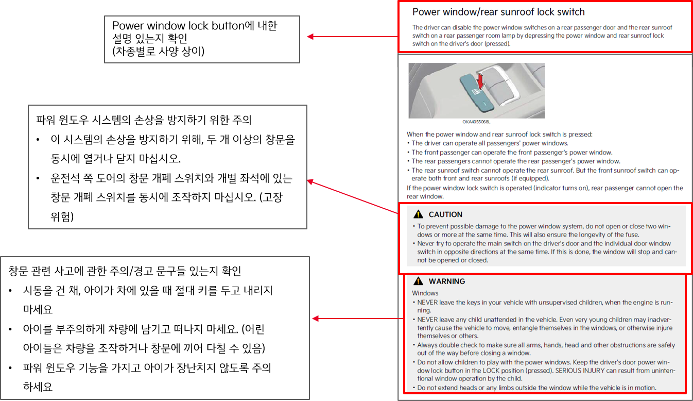

- [X] Sunroof
  - 선루프 작동에 대한 설명 및 경고 내용이 적용되어 있는지 확인(주로 부상 가능성과 어린이 오조작에 대한 경고 내용)
  - 차량 정차 상태에서의 조작 원칙 준수
  - 어린이 안전 확보: 단시간 하차 시에도 반드시 시동을 끄고 키를 소지할 것
  - 조작 전 주변 상황 확인: 신체 일부나 이물지의 끼임 유무 확인 필수
  - 임의 테스트 금지: 신체를 이용한 자동 역회전(Anti-pinch) 기능의 정상 작동 여부를 직접 테스트하지 말 것
  - 선루프 관련 내용은 유럽 법규의 두 영역에 걸쳐 적용되므로 해당 내용을 누락 없이 확인 필요
  - 중요 주의 및 경고 사항은 가독성과 강조를 위해 섹션 내 여러곳에서 반복적으로 노출됨

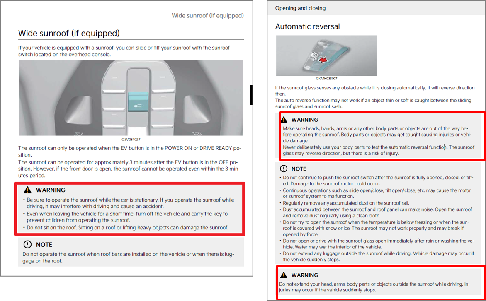

# 냉매 라벨

## 오너스 매뉴얼 적용  :writing_hand:*법규 불화온실가스(F-가스) 규제 개정*
- Controls and features 챕터 중, **Air conditioning(A/C) refrigerant label** 내용으로 구성
  
## :open_book: 왜 냉매 라벨까지 유럽 법규가 관리할까?
- [X] 규제 대상의 확대
  - 차량 냉매가 단순 정보 제공 차원을 넘어, 실질적인 환경 규제 준수 항목으로 관리됨
- [X] 기후 위기 대응
  - 온실가스 감축을 위한 GWP(지구 온난화 지수) 친환경 냉매 채택 및 사용 가속화
- [X] EURO7과의 연계성
  - 차량의 전 생애 주기별 환경 영향을 관리하는 EURO7 규제와 결이 같으며, 배출가스 외 항목까지 관리 범위 확장
- [X] 현재 유럽 규제 방향은?
  - 배출 가스
  - 브레이크 분진
  - 타이어 마모
  - 냉매
  - 에너지 효율

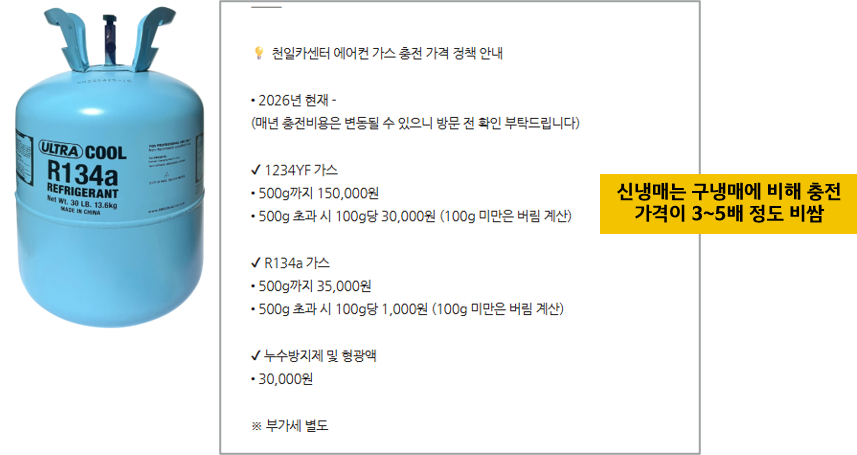

## :dart: 실무자 이해 포인트
- [X] 정확한 냉매 종류 및 정비 정보 누락은 오정비로 인한 환경 오염이나 차량 고장 등 법적 리스크로 이어질 수 있음
- [X] 냉매 정보의 오너스 매뉴얼 기재는 단순 정보 제공이 아닌, 유럽 시장 판매를 위한 필수 인증 요건임을 명확히 인지 필요
- [X] 더불어 냉매 제원인 Air conditioning systme과도 내용이 연계되어있으니 한 번 더 체크

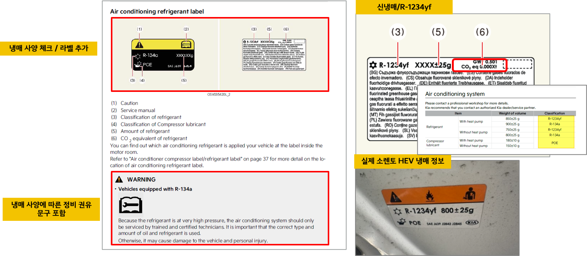

# 전기차 충전라벨 정보

## 오너스 매뉴얼 적용  :writing_hand:*법규 조항 2014/94/EU*
- Specifications 챕터 중, **How to check the symbol on the charging labe(for Europe)**로 적용
  
## :open_book: 유럽에서는 고객이 처음 보는 충전기를 사용할 때, 어떻게 해야할까?
- [X] 국경 없는 충전 환경
  - 차량 측 입구와 충전기 커넥터에 동일한 식별 라벨 부착 의무화
  - 유럽 연합 내 국가 간 이동 시에도 중단 없는 충전 서비스 제공 필요  
     📍유럽은 이동 특성 상, 자동차로 국경을 넘나들 수 있음  
     📍즉, 고객은 처음 보는 충전소를 계속 경험하게 되고 낯선 상태에서 충전을 시도함  
     📍충전 라벨 정보를 기재하게 함으로서 단순 참고 자료가 아닌 충전 라벨에 대해 설명하는 법규 전달 수단이 됨

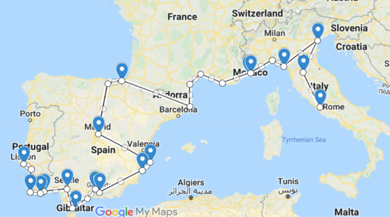

## :dart: 실무자 이해 포인트
- [X] 단순한 충전 절차 설명보다, 충전 라벨이 내포한 식별 의미와 호환성을 명확히 전달하는 것이 오너스 매뉴얼의 핵심 역할
- [X] 차량의 기계적 기능만큼 중요한 것이 사용자의 혼란 방지, 따라서 유럽 법규가 정보 전달 방식을 엄격히 규제하는 이유는 오사용으로 인한 안전사고를 예방하기 위함
- [X] 유럽은 에너지 보급이라는 관점에서 충전과 주유를 동일한 범주로 취급
  - 내연기관: 혼유(가솔린/경유/LPG)로 인한 차량 파손 방지를 위해 라벨 관리
  - 전기차(EV): AC/DC 커넥터 오접속 및 호환성 문제를 방지하기 위해 주유구 라벨과 동일한 수준의 엄격한 정보 제공 필요

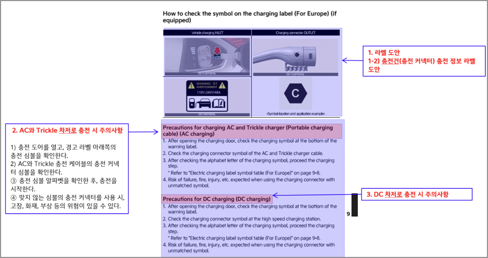

# 오토 플러시 도어 핸들

## 오너스 매뉴얼 적용  :writing_hand:*법규 조항 Euro NCAP escue 평가 프로토콜 (ver.1.0)*
- Opening and closing 챕터 중, **Door locks** 하위로 적용
  
## :open_book: 문 손잡이가 그렇게 중요한가?
- [X] 숨겨진 손잡이는 디자인은 예쁘지만, 비상시에는 문을 열기 어렵게 만들어 안전을 위협할 수 있다는 것이 법규적 판단
- [X] 법규적 관점에서는 어떠한 비상 상황에서도 차량 내외에 있는 사용자가 문을 열고 탈출할 수 있어야 하는게 핵심
- [X] 오토 플러시 도어 핸들은 도어 판넬 안에 들어간 형태이기 때문에, 문을 열기 전 도어 핸들을 잡기 위해서 특별한 액션이 필요한 경우
  - 따라서 평상시 혹은 위급시에도 사용자가 도어 핸들에 접근할 수 있도록 오너스 매뉴얼에 안내 요구됨

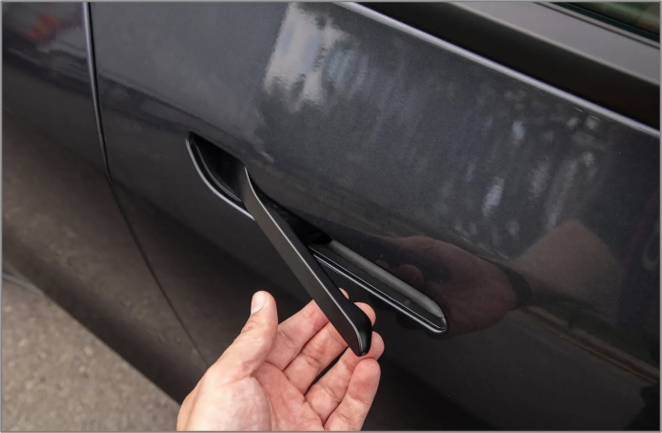

## :dart: 실무자 이해 포인트
- [X] 오토 플러시 도어 핸들을 디자인이나 편의성이 좋은 것보다는, 사용자 행동 관점에서 내용을 바라보는 것이 필요
- [X] 유럽은 정상 상황보다 비정상적인 상황을 더 중요하게 생각하며 법규를 규제하는 경향이 있음
  - 고객이 문을 열지 못하게 되는 상황을 가정했을 때, 문을 열 수 있는 방법에 대해 고지가 되었는지 체크
  - 도어 핸들을 디자인이 아닌 비상 탈출 수단으로 체크
- [X] 실제 사용자는 매뉴얼을 읽지 않고 바로 문을 열려고 하는 경우가 더 많기 때문에, 유럽 법규는 직관적으로 탈출 가능한 지에 대해서 관리

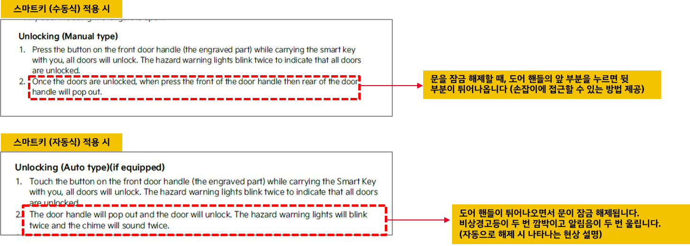

# AVAS 정지 기능

## 오너스 매뉴얼 적용  :writing_hand:*법규 개정 R-138.01*
- Electric vehicle guide 챕터 중, **Virtual Engine Sound System(VESS)** 내용으로 구성
  
## :open_book: 전기차가 너무 조용하면 무슨 일이 생길까?
- [X] 전기차의 특성상, 엔진이 없기 때문에 차량 소리가 거의 없으며 접근 인지가 어려움
- [X] 편의 기능이 아닌 보행자 보호 장치이며, 차량 접근을 소리로 판단하는 사람들을 보호하기 위한 목적
- [X] 운전자가 임의로 꺼둘 수 없게 강제하며, 일시 정지는 가능하지만 영구적 비활성화는 금지
- [X] 유럽이 전기차 시대에 새롭게 규제하는 보행자 안전 규제로 이해하면 좋음

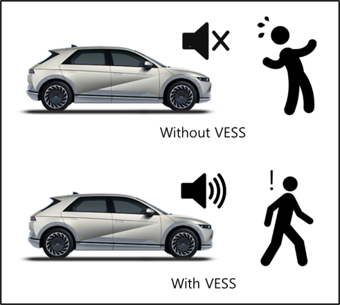

## :dart: 실무자 이해 포인트
- [X] 사용자가 전기차를 사용하면서 내연기관의 배기음을 즐길 수 있는 기능이라고 생각했다면 오해
- [X] AVAS의 진짜 대상은 보행자나 어린이, 고령자, 시각 장애인이기 때문에, 보행자를 보호하기 위한 관점으로 내용 이해 필요
- [X] 해당 기능은 영구적으로 끌 수 없으며, 차량 존재를 알리기 위해 상시 켜져있어야 함을 법으로 강제함(2019년 7월부터는 의무 장착)
- [X] VESS 버튼의 유무로 법규 적용 내용이 달라짐
  - KMC 차종은 VESS 버튼이 없는 사양으로 양산되고 있음

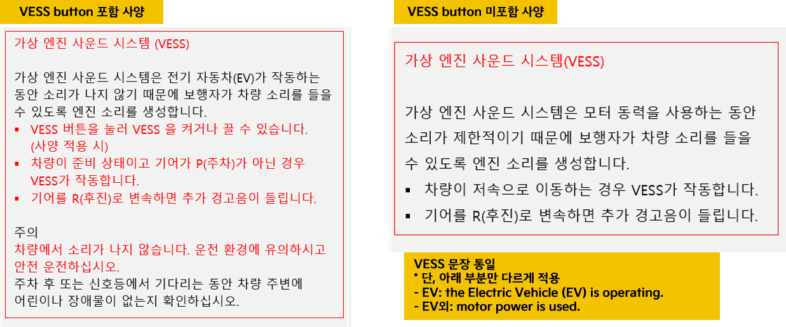

# 전조등 점등 자동 제어

## 오너스 매뉴얼 적용  :writing_hand:*법규 UN R48.08*
- Driver adjustment 챕터 중, **Lightings > Headlights (Low Beam)** 내용으로 구성
  
## :open_book: 만약 운전자가 전조등 컨트롤을 잊어버리면 누가 대신 켜줄까?
- [X] 유럽은 *운전자의 실수*를 전제로 해당 법규를 관리함
  - 과거에는 운전자의 자율성에 맡겼지만, 실제 사고 데이터는 운전자가 전조등을 켜지 않아 발생하는 사고가 많음을 보여줌
  - 따라서, 운전자의 실수를 시스템이 보완해야한다고 법규는 판단함
- [X] 운전자의 사야가 아닌 타인의 시야가 핵심
  - 어두운 환경에서, 운전자가 사물을 보기 위한 것이 아닌 다른 사람이 내 차를 볼 수 있도록 하는 안전 기능에 가까움
- [X] 유럽은 낮에도 전조등을 켜도록 강제함
  - 운전자가 전조등을 켜는 것을 잊어 발생하는 사고를 줄이기 위해, 낮에도 자동으로 켜지는 주간전조등(DRL) 장착을 의무화함
  - 한국은 아직 법적으로 강제하고 있지는 않으나, DRL 장착은 의무화 되어있음

## :dart: 실무자 이해 포인트
- [X] 오너스 매뉴얼은 조명 기능(위치, 조작 방법)에 대한 단순한 설명서가 아님
- [X] AUTO 조명 역시 운전자의 편의를 위한 것이 아니라, 도로 위 모두의 생명을 위한 기능
- [X] 주간주행등(DRL)에서 하향등(Low Beam)으로의 자동 전환 및 운전자의 임의 조작 제한에 대해 강화된 기준을 명확히 인지
- [X] 따라서 오너스 매뉴얼에는 아래 내용이 반드시 포함되어야 함
  - 자동 점등 로직: 어느 정도로 어두워질 때 전조등의 불이 들어오는지 설명
  - 사용자의 개입이 아닌 의무 고지: 사용자는 해당 법규에 따라 수동으로 전조등을 끌 수 없음을 고지

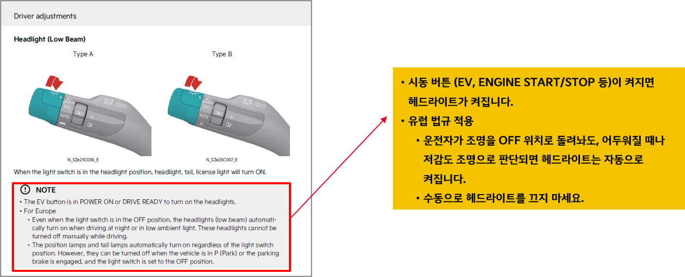
